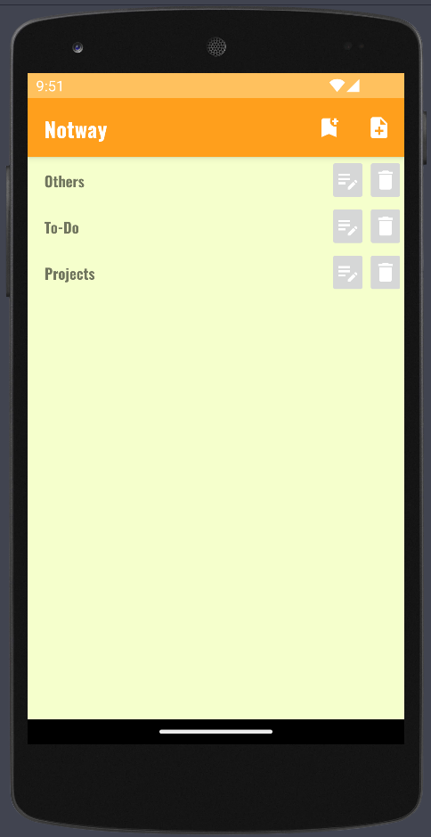
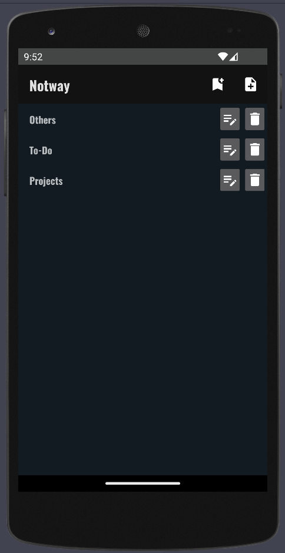
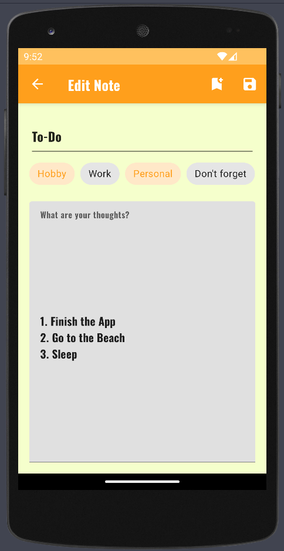
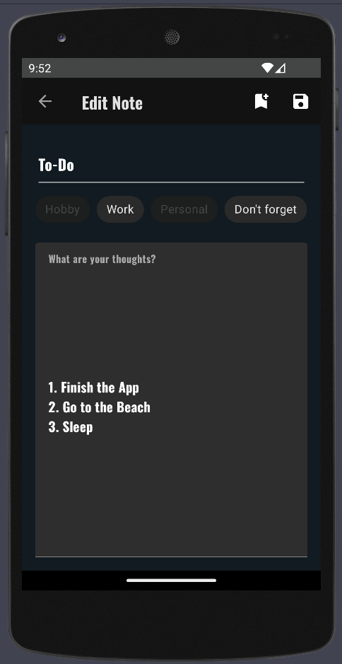
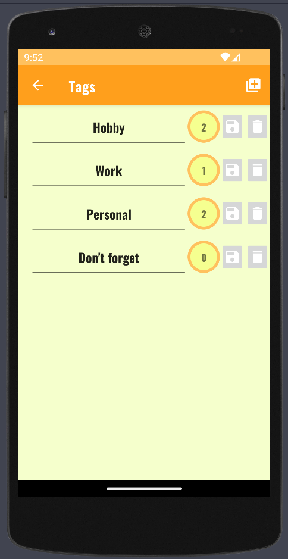
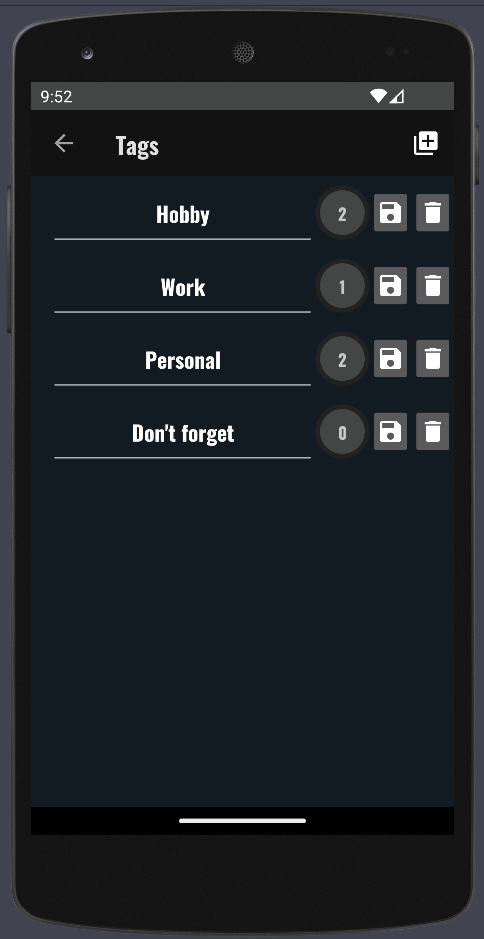

# 📱 Notway
## 💊 _[Rakioth][R] & [Quathar][Q]_ ☄️

[Q]: https://github.com/Quathar
[R]: https://github.com/Rakioth
This is an Android Mobile Application for notes called **Notway**.

In this application you can manage your personal notes as well as the tags associated with them.

Database manipulation is done via [Room](https://developer.android.com/jetpack/androidx/releases/room?hl=es-419).

# 🌆 Views
The application contains 3 different views.

- General View for global notes management.
- Notes View for a specific note managment.
- Tags View for global tags managment.

All the app's views are shown below with light and dark themes.

## 🗒️ Main View

    
    

## 📝 Notes View

    
    

## 🏷️ Tags View

    
    

